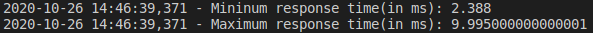

# mattermost-search-analytics

## Setup instructions
* Install python 3.6+ and pip.
* Run `pip3 install -r requirements.txt` in project directory to install the depedencies.
* Create a file `.env` and paste the contents of `.env.sample` in it.
    ```
    cat .env.sample > .env
    ```
    * Set mattermost server URL as API_URL. 
    * Set team id for which you want to perform the search as TEAM_ID. You can retrieve team id from the database.
    * Set personal access token as ACCESS_TOKEN.
        * You have to enable personal access tokens in `System Console > Integrations > Custom Integrations`.
        * To create a personal access token, go to `Account Settings > Security > Personal Access Tokens` and click `Create New Token`.
        * You can refer [here](https://docs.mattermost.com/developer/personal-access-tokens.html#personal-access-tokens) to know more about how to create personal access token.
* Create a search query input file similar to `search.txt.sample`. 

## Run script
   * Use this command `python test.py <input-file> <output-file>` to generate a report.
   * if no `<output-file>` is provided, then it will generate a report with filename `<input-file>-timestamp.csv`.
   * example -<br> 
       > `python search.py search.txt output.csv
        `<br>
        If everything is configured correctly. This command will generate a `output.csv` file and log the info similar to this.
        
        >
